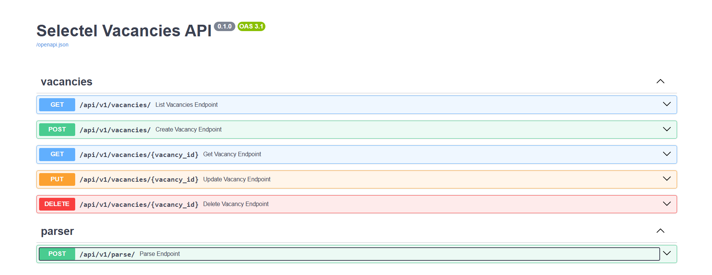
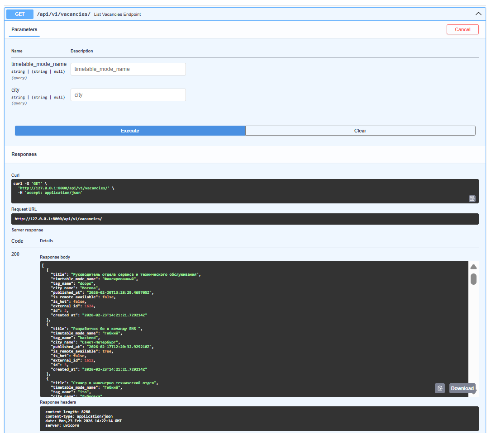
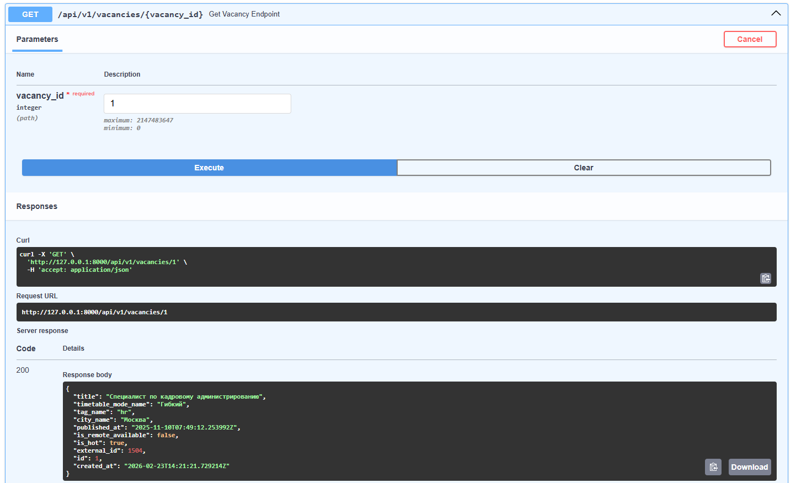
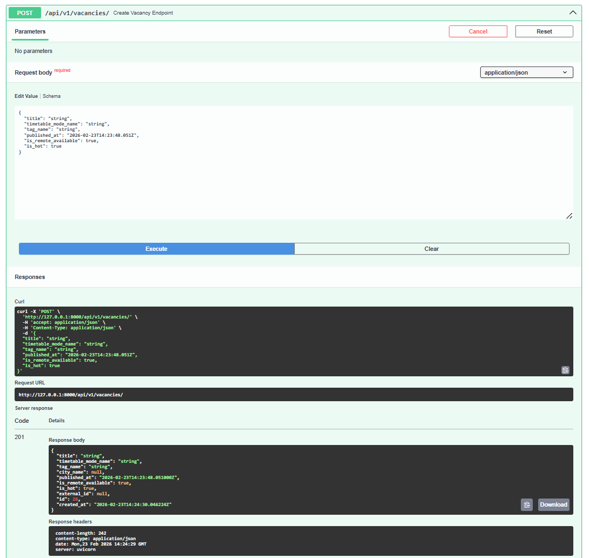
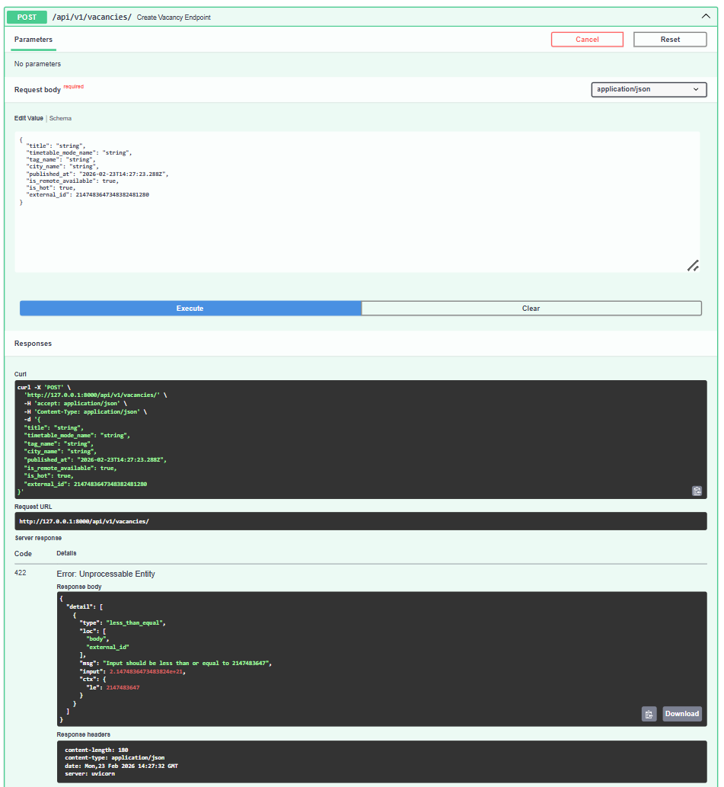
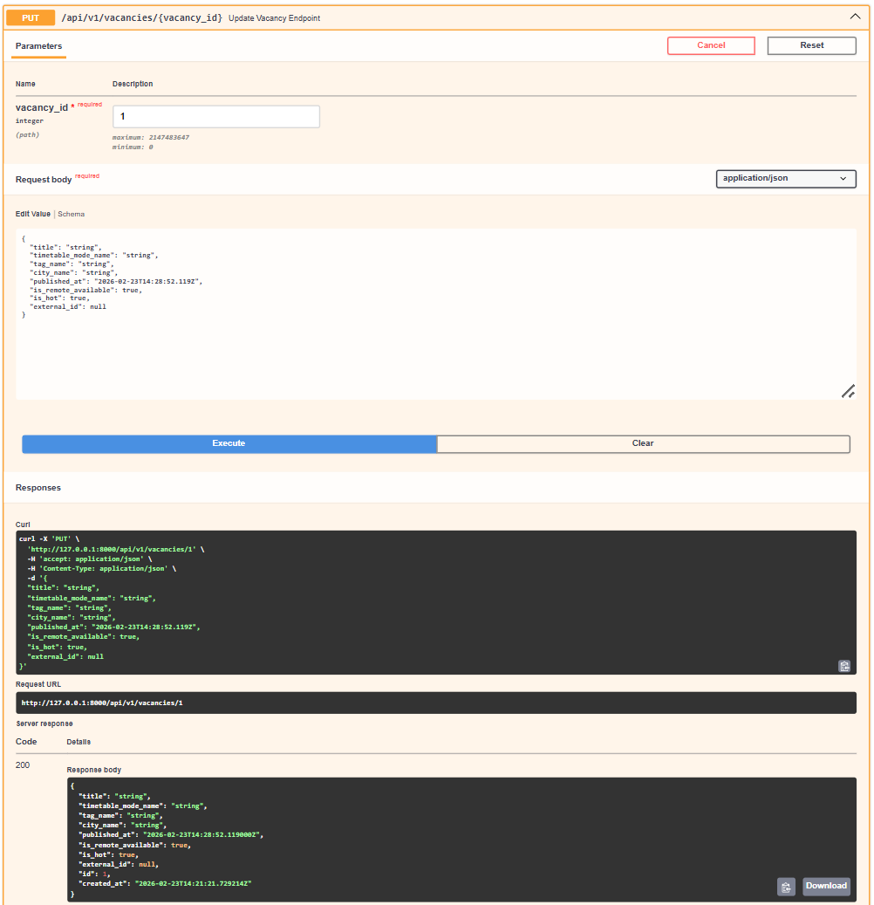
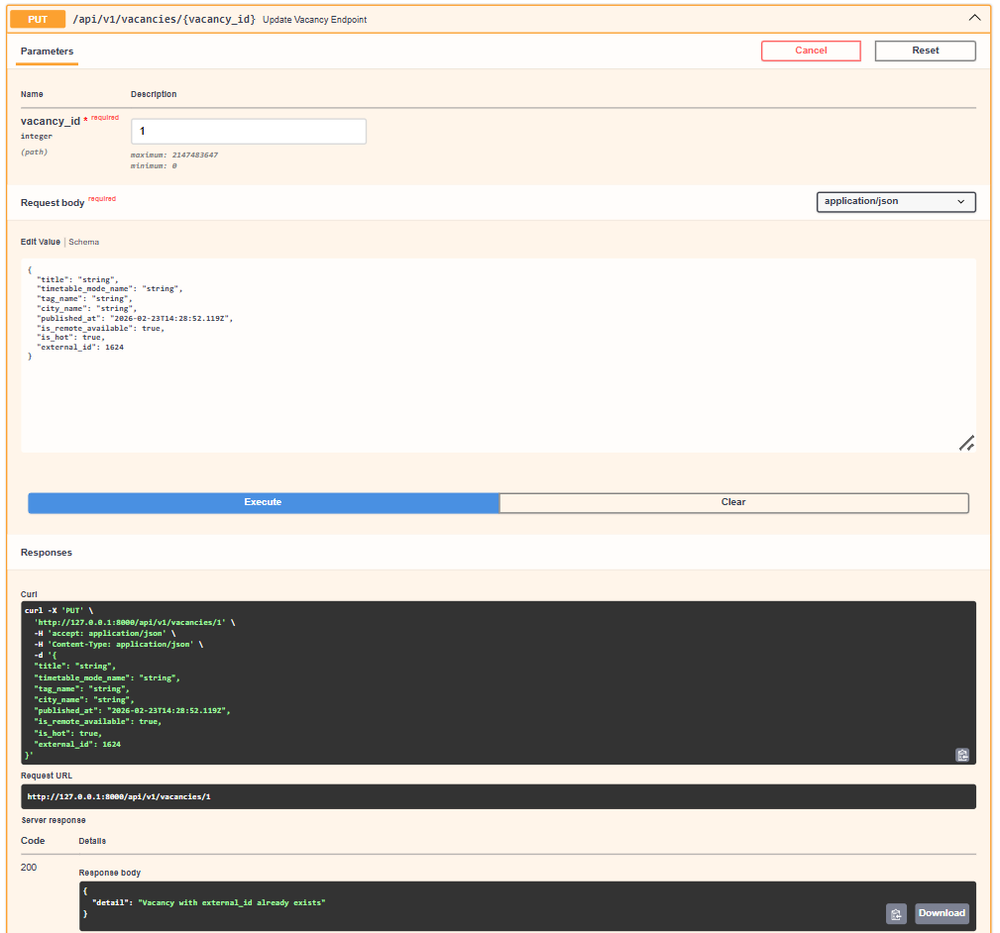
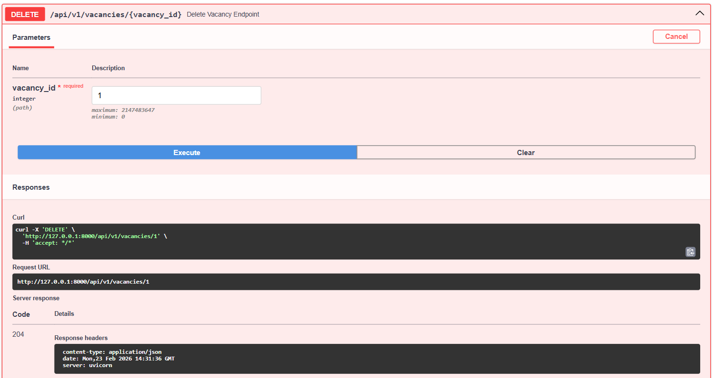
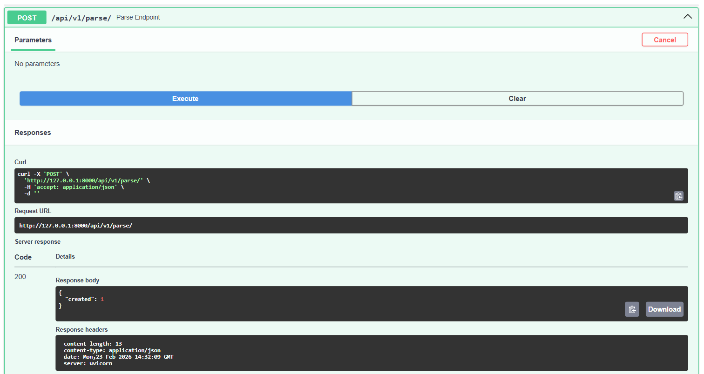

# Selectel Vacancies API

FastAPI-приложение для парсинга публичных вакансий Selectel, хранения в PostgreSQL и предоставления CRUD API.

## Быстрый старт

1. Клонируйте репозиторий (или распакуйте проект из архива):
   `git clone --branch with-bugs https://github.com/selectel/be-test.git`
2. Создайте `.env` на основе примера:
   `cp .env.example .env`
3. Примените переменные окружения `.env`:
   `source .env`
4. Запуск через Docker Desktop:
   `docker compose up --build`
5. Проверка работоспособности:
   откройте `http://localhost:8000/docs`
6. Остановка и очистка:
   `docker-compose down -v`

## Переменные окружения

- `DATABASE_URL` — строка подключения к PostgreSQL.
- `LOG_LEVEL` — уровень логирования (`INFO`, `DEBUG`).
- `PARSE_SCHEDULE_MINUTES` — интервал фонового парсинга в минутах.

## Основные эндпоинты

- `GET /api/v1/vacancies/` — список вакансий
- `GET /api/v1/vacancies/{id}` — детали вакансии.
- `POST /api/v1/vacancies/` — создание вакансии.
- `PUT /api/v1/vacancies/{id}` — обновление вакансии.
- `DELETE /api/v1/vacancies/{id}` — удаление вакансии.
- `POST /api/v1/parse/` — ручной запуск парсинга.

## Примечания

- При старте приложения выполняется первичный парсинг.
- Фоновый парсинг запускается планировщиком APScheduler (в рамках заданного интервала).

## Отчет по отладке приложения Демидов Роман Михайлович

### Запуск
   1) Выполнил сборку и запуск
      - Проблема: Возникла `pydantic_core._pydantic_core.ValidationError: Extra inputs are not permitted`
      - Решение: добавил параметр `extra="allow"` в `SettingsConfigDict`
   2) Перезапустил приложение
      - Проблема: Возникла `asyncpg.exceptions.InvalidCatalogNameError`
      - Решение: было неверно указано имя переменной `DATABASE_URL`, исправил и перезапустил приложение *Опять опечатка?)*
 ### Отладка работы приложения
   1) Приложение запустилось с ошибкой парсера
      - Проблема: Возникла `AttributeError` при парсинге публичных вакансий
      - Решение: Отсутсвовала проврека поля `ExternalVacancyItem.city` на возможное принятие типа `NoneType`, добавил проверку, `city` теперь может принимать значение `None`
   2) Заметил что вакансии парсяться слишком часто:
      - Проблема: Вакансии прибывают каждые 5 секунд, не минут
      - Решение: В `AsyncIOScheduler.add_job` заменил параметр `seconds` на `minutes`
   3) В логах возникает предупреждение от планировщика о пропуске задач парсинга
      - Проблема: Некоторые задачи опаздывают, планировщик их пропускает
      - Решение: В `AsyncIOScheduler.add_job` установил параметр `misfire_grace_time=30`, теперь задачи могут быть запущенны с опозданием до 30 секунд
### Проверка эндпоитов:
   1) Проверил каждый энпоит, с ожидаемыми данными все работают корректно
   2) Проверил `POST /api/v1/vacancies/` на созданик вакансии с существующим `external_id` (работает корректно) и `PUT /api/v1/vacancies/{id}` на измение `external_id` на существующий
      - Проблема: Сервер выдает 500 статус код, возникла Duplicated Key Error в бд
      - Решение: Добавил проверку `external_id` на существование, если его ещё нет, вакансия измениться, если уже есть отправиться ошибка аналогично `POST /api/v1/vacancies/`
   3) Прверка на дурака:
      - Проблема: При попытке получить вакансию по большому `vacancy_id`, возникает ошибка превышения допустимого диапазона для целочисленных типов в 32 бита в бд
      - Решение: Добавил валидатор для `vacancy_id` и `external_id`, ограничив их (поставив допустимый диапазон от 0 до 2 ^ 31 - 1)
   4) Проверка эндпоинта `POST /api/v1/parse/` и парсера
      - Проблема: Изменение данных вакансии без изменения `external_id`, может привести к неожидаемому поведению, при парсинге проверяется, существуют ли в бд вакансии с таким же `external_id`, как у публичных вакансий, если они есть, то выполняется обновлене вакнсии в бд, её поля заменяются на поля публичной вакансии, что может привести к неожидаемому результату: изменённая через `PUT /api/v1/vacancies/{id}` после парсинга будет заменена на публичную вакансию
      - Решение: Убрал строчки, отвечающие за обновление вакансии из `upsert_external_vacancies`

### Ещё некоторые наблюдения:
   1) Очень много дублирования кода при возможности переисользования готовых функций
   2) Эндпоинты слишком громоздкие, есть возможность их облегчить до одной строчки, например, за счет вынесения валидации в отдельный слой
   3) При использовании ORM, лучше использовать его возможносии, а не взаимодействовать напрямую с сессией
   4) Есть ещё моменты отсутствия валидации, но они не ломали приложение (я пытался запихать огромную строку в название вакансии, но у меня сваггер завис быстрее, чем само приложение), поэтому я не относил их к багам, например, есть возможность создавать вакансии с указанием времени в будущем, поэтому они будут всегда сверух в `GET /api/v1/vacancies/`, лучше убрать вообще давать возможность пользователям менять время публикации, или ограничить само поле
      
### Итоги:
   1) Все эндпоинты работают корректно
   2) Парсинг выполняется согласно расписанию, без падений и без неожидаемых изменений
      
      
      
      
      
      
      
      
      

